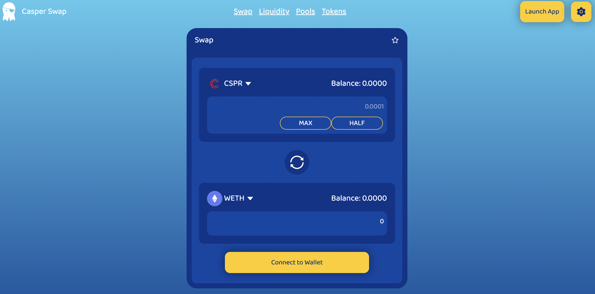
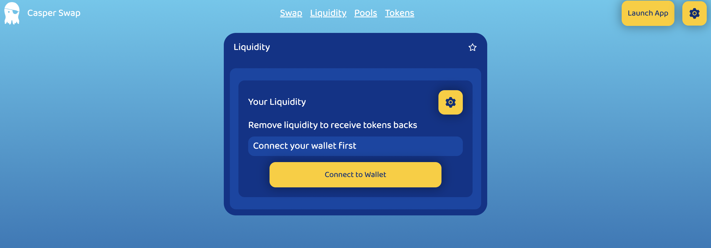
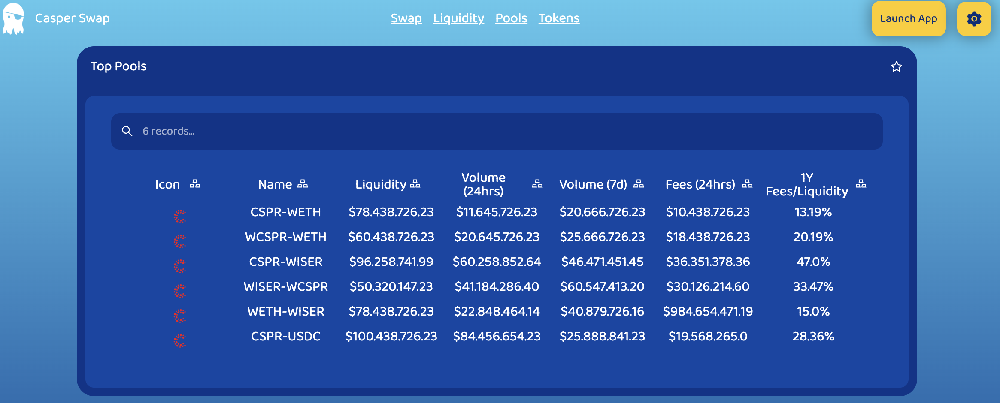
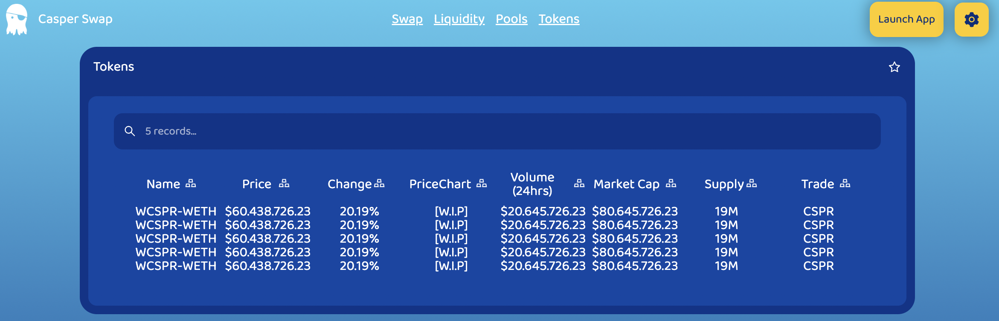

# Casper Swap Documentation page

## Dependencies

the main dependencies are:

* Typescript
* ReactJS
* React-Router
* Styled-Components
* React-Hot-Toast

**Use last signer version**

* [Signer Wallet](https://chrome.google.com/webstore/detail/casper-signer/djhndpllfiibmcdbnmaaahkhchcoijce)
## Components

i use atomic design in the project, see more reference

[Atomic Design](https://bradfrost.com/blog/post/atomic-web-design/)

## Pages

[Landing](images/01_landing.md)

[Swap](images/02_swappage.md)

Liquidity

Pool

Token

