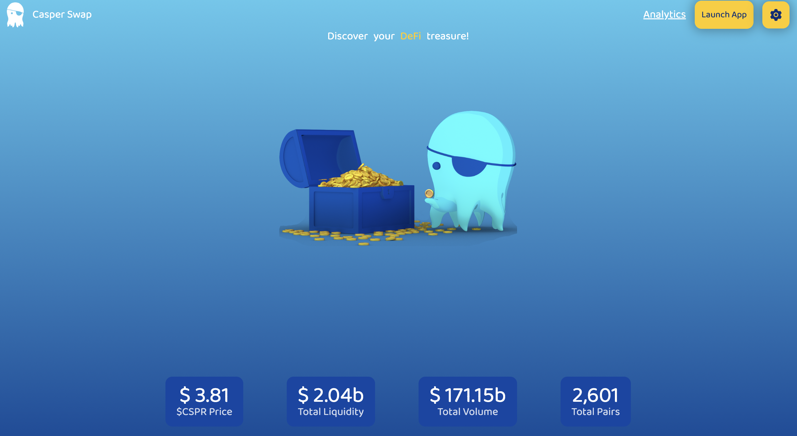
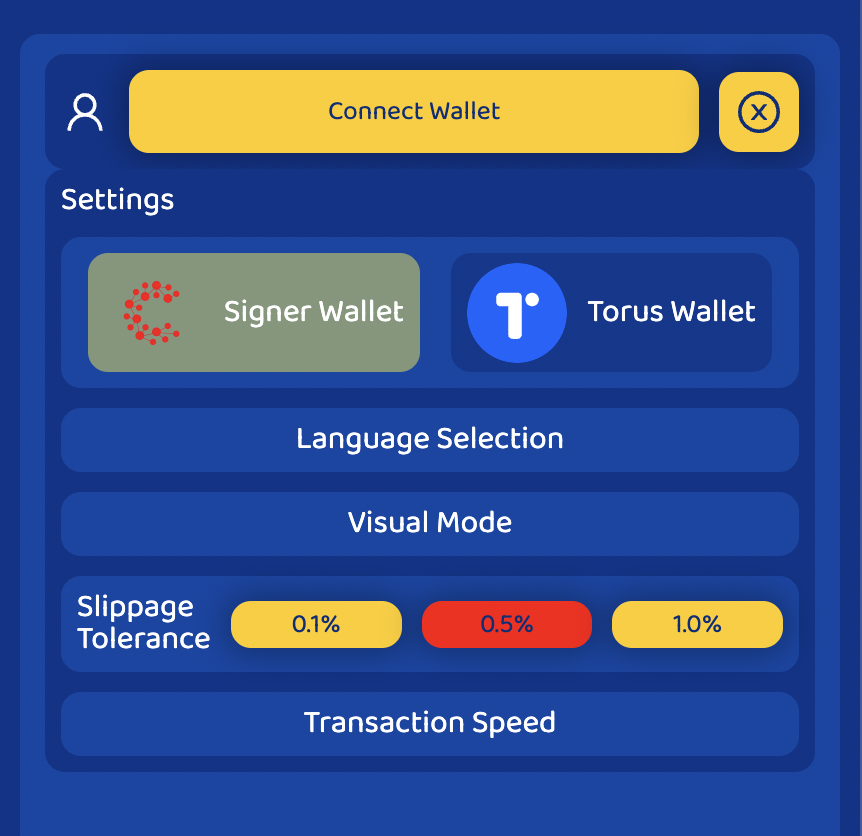
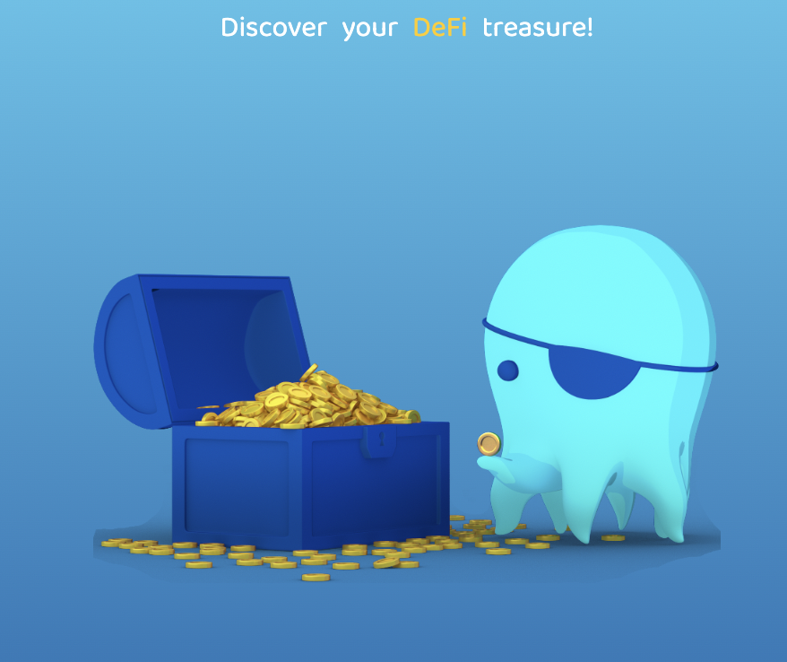
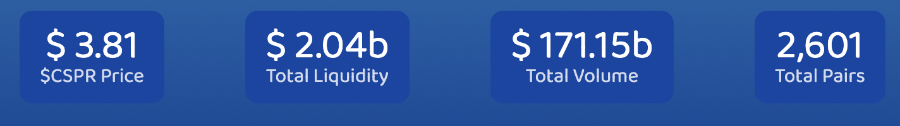

# Landing Page

## UI Components

### landing header

* brand with route to landing page
* Menu bar
    * Analytics with link to analytics page
    * Launch App with route to Swap Page
    * Engine Icon open config modal

#### Config Modal

* Connect wallet button
* Close modal button
* Settings Section
    * Wallet selection (Signer or torus)
    * Language selection (EN-ES)
    * Visual mode selection (dark-light)
    * Slippage Tolerance
    * Transaction Speed

in react we have differents states inside the app, connect wallet button perform a connection between wallets and current state, the login process of signer it explained in:

[Login Process](20_login.md)

then the page triggers the getbalance process

[GetBalance Process](20_getbalance.md)

when the user switch wallets they are logout automatically

### landing body

### footer body

