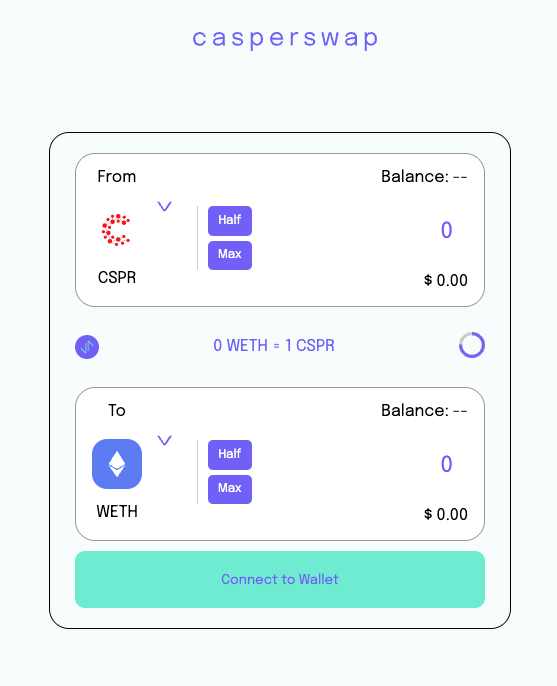
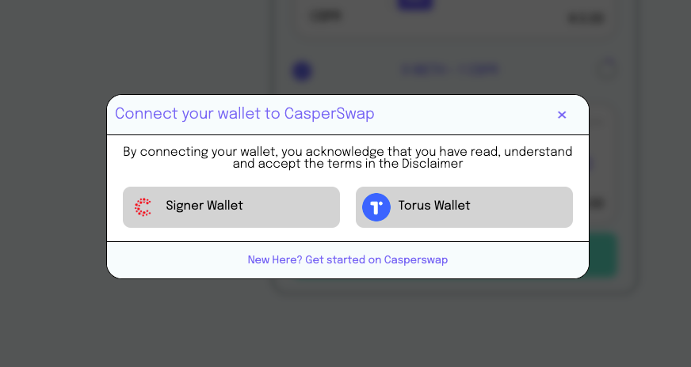
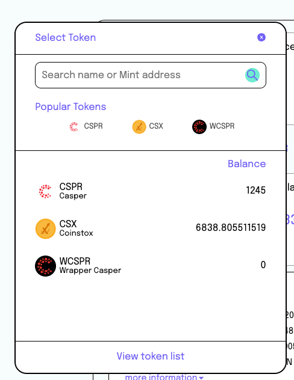
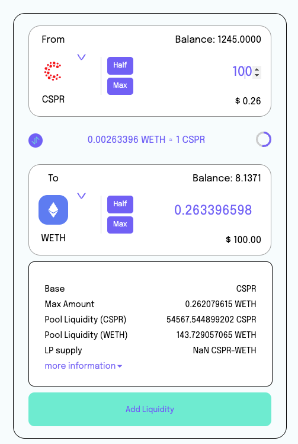
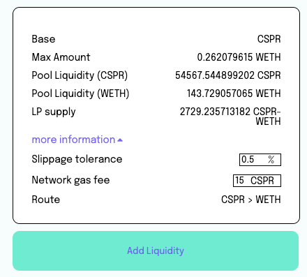
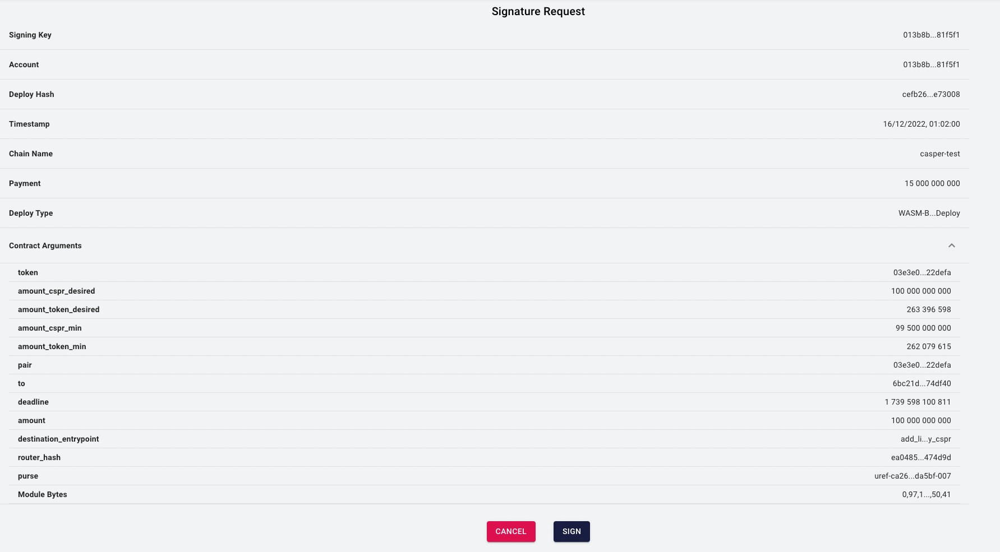
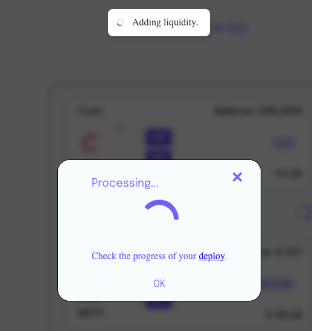
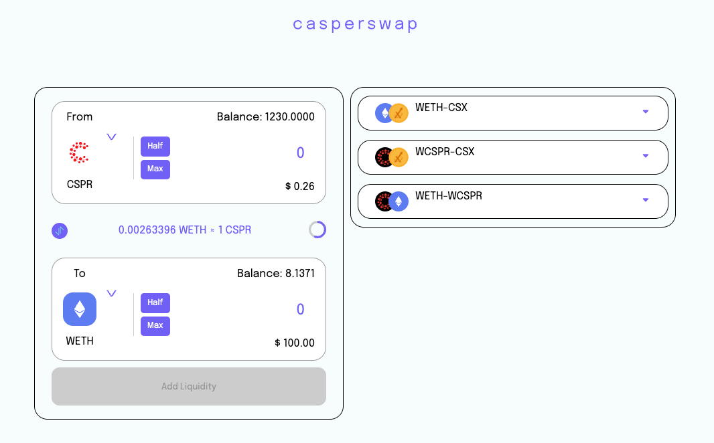

# Liquidity Page

# Confirmation Process to create a token lp
- CSPR -> ERC20 : When you want to create a Liquidity Pair using a Casper token:
- - it selects the entry point internally (**add_liquidity_cspr**). 
- - After that, this contract will be saved in a special purse from Casper (this purse will be given by the server). 
- - - it uses the API entrypoint called **getWasmData** to get the last deploy performed at that purse.
- - After all of this, it shows the contract to be firm through Casper Signer. 
- - An internal process will be checking if the transaction state

- ERC20 -> ERC20 : 
- - it selects the **add_liquidity_js_client** entrypoint for ERC20 tokens.
- - when you perform operations between two ERC20 tokens, **you don't need to use a special purse** to save the tokens.
- - After all of this, it shows the contract to be firm through Casper Signer.
- - An internal process will be checking if the transaction state 

# Overall Flow

##1º Wallet Connection

##2º Select the token and insert a value in any input

##3º LP Detail will be shown, this detail contains the user liquidity pair that will be created

##4º Before confirming the swap, you need to approve the ERC20 tokens.

##5º Firm the transaction from Casper Signer

##6º Wait for successful transaction. You can also see the transaction link clicking *deploy*

##7º After confirming the transaction, the user liquidity list will be updated and will appear next to the add liquidity box

## UI Components

### The Liquidity Page
### Connection Wallet
### LP Detail
### Token Menu
### Liquidity Item