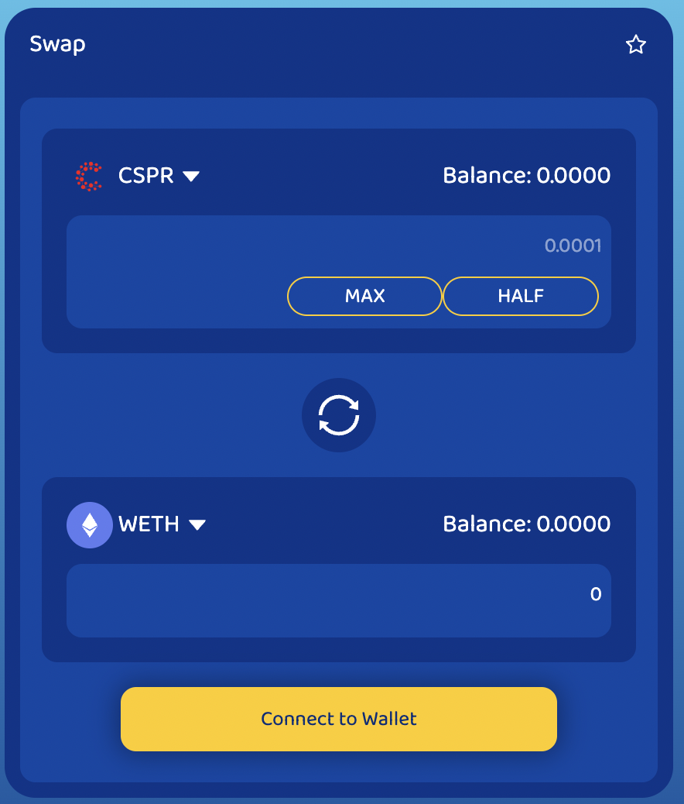
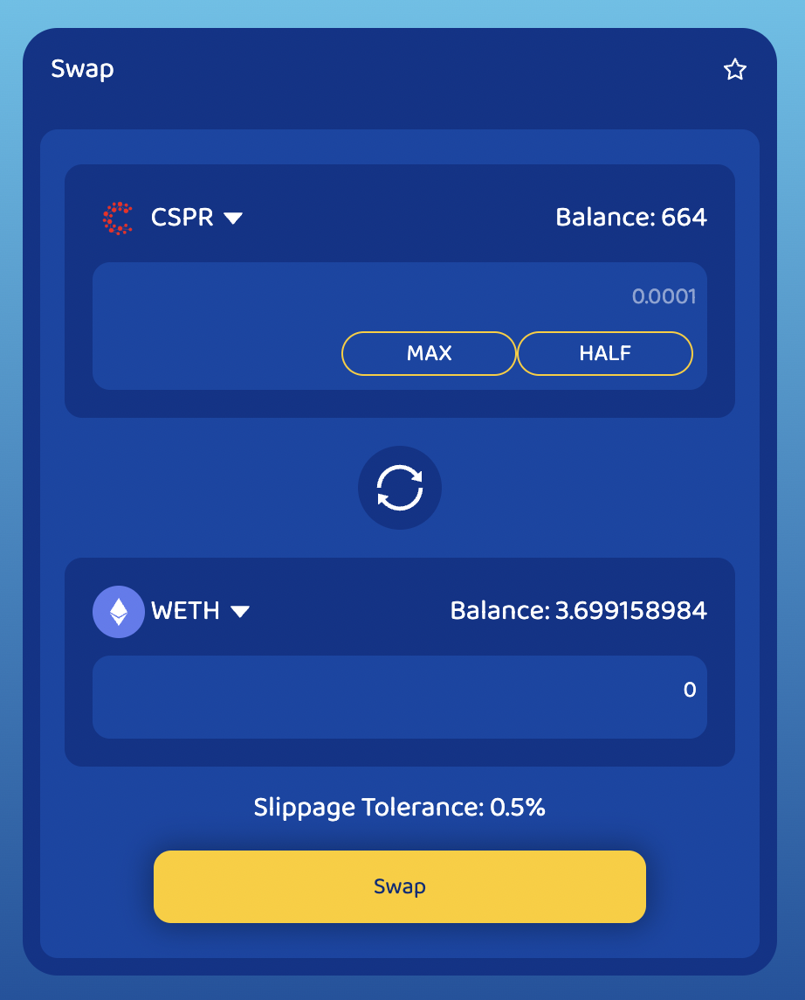
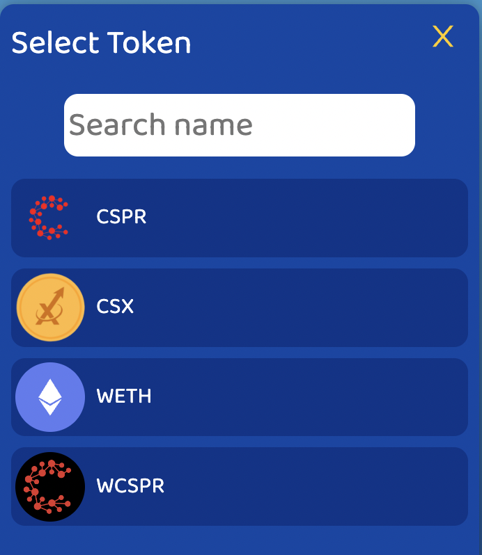
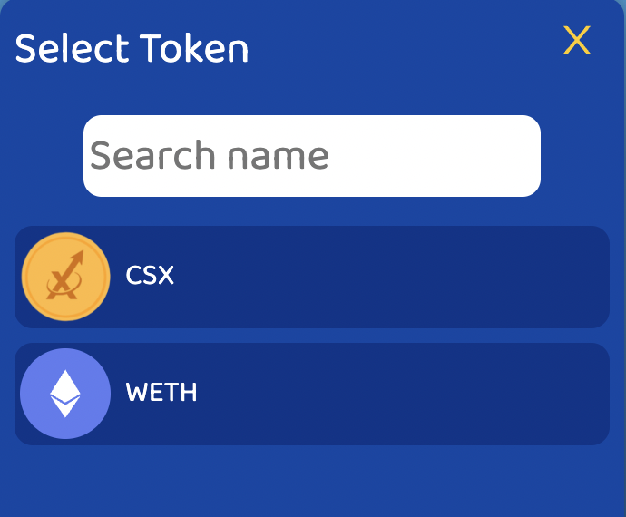
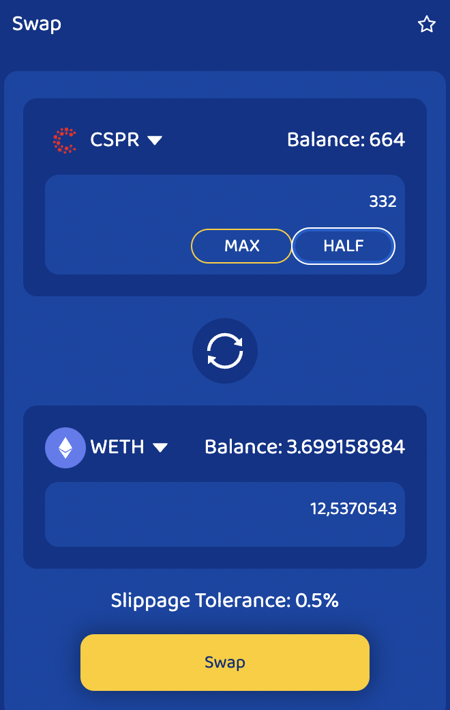
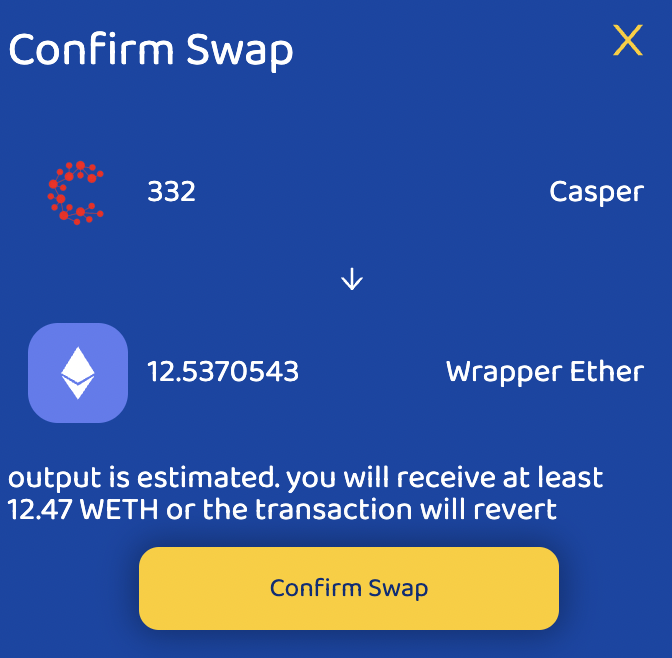
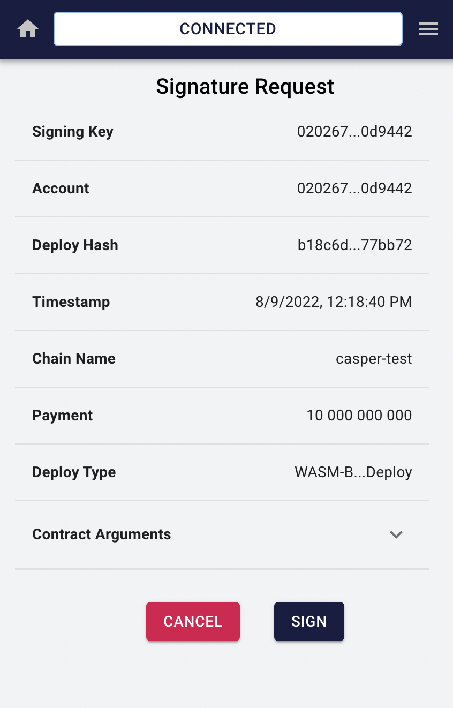

# Swap Page

## UI Components

### Swap headers

header contain a menu nav for all pages

* Swap
* Liquidity
* Pools
* Tokens

### Swap Body

this is the main component in swap.

button connect wallet triggers two process.

* [Login Process](20_login.md)
* [GetBalance Process](20_getbalance.md)

then with those state updated show to user balance in him wallet

when user click on Token Icon page show a new modal

in there user can select a new token for swap, this modal is feed for Token state.

both button have the same behavior, but when you click on token B selection the list is filtered for first token

the button in the middle switch tokens

when both token are select the user can change the input value of token A, this action trigger a call from update token B value using the APIs called [Get Path Reserves](10_Apis.md)

when two token have a number to be swap the user can click the button on the middle, and then a new modal is displayed

then if the user click the swap confirmation signer display a new windows for sign the transaction to approve swap

when the trasaction is finished the balance in the wallet is updated.