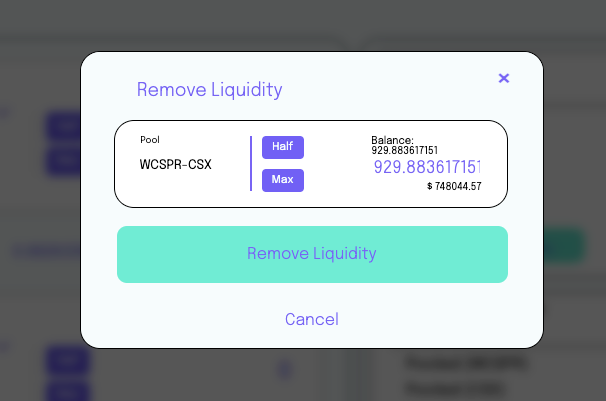
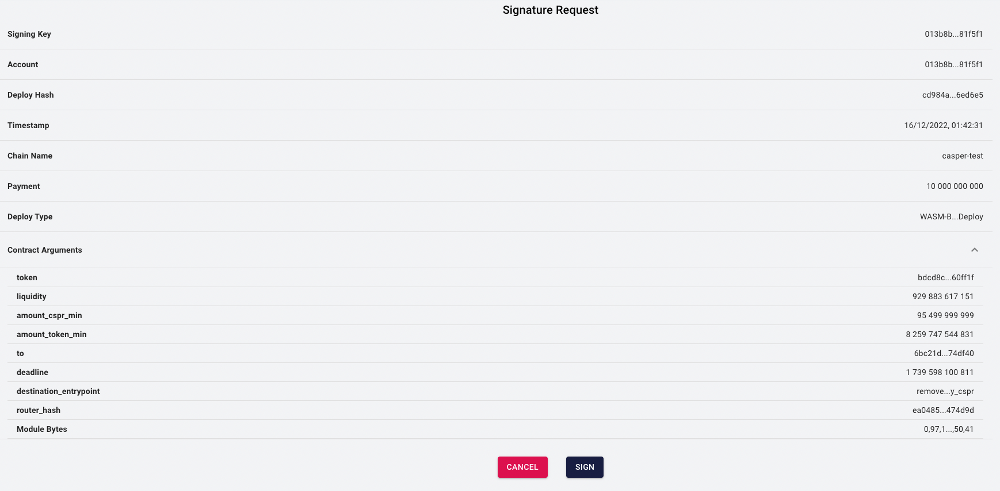
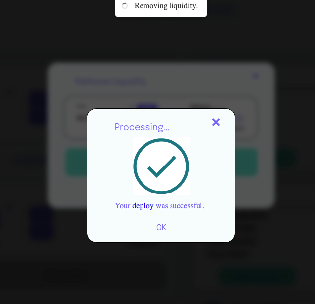
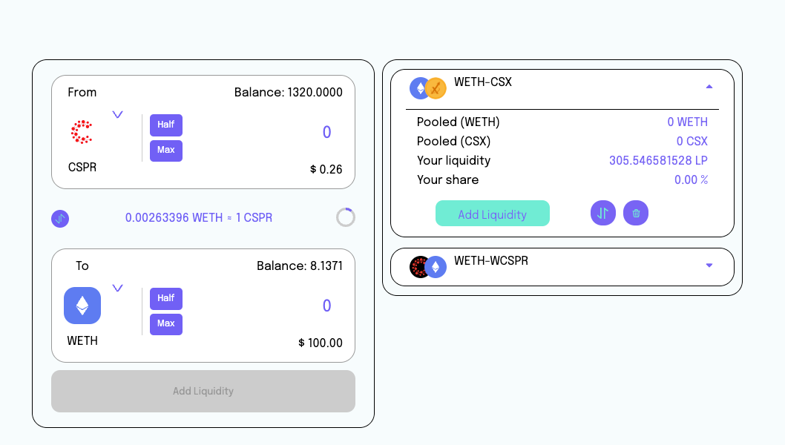

# Liquidity Page

# Confirmation Process to recover the tokens
- CSPR - ERC20 : 
- - the *remove_liquidity_cspr* entry point will be used for exchanging
- - it retrieves the purse (This contract hash is given by the server) to refund tokens to your wallet

- ERC20 - ERC20 : the *remove_liquidity_js_client* entry point will be used for exchanging
- - Firstly, we need to recover the contract hash using the package hash. 
For that reason, we need to use this endpoint: **[BASE_URL]/getContractHashAgainstPackageHash**
- - you don't need to use any purse to recover tokens because you already requested before when you retrieved the contract hash.

# Overall flow

##1º Wallet Connection

##2º Select a user liquidity pair

##3º Insert a value in any input; after that, you'll probably need to approve the token amount firstly

##4º After approving the token amount, click *Remove Liquidity*

##5º Confirm Liquidity Removing

##7º Wait for successful transaction

#8º Finally, if you remove all liquidity, an item should have been removed

## UI Components

### The Liquidity Page
### Connection Wallet
### Liquidity Item
### Liquidity Removing