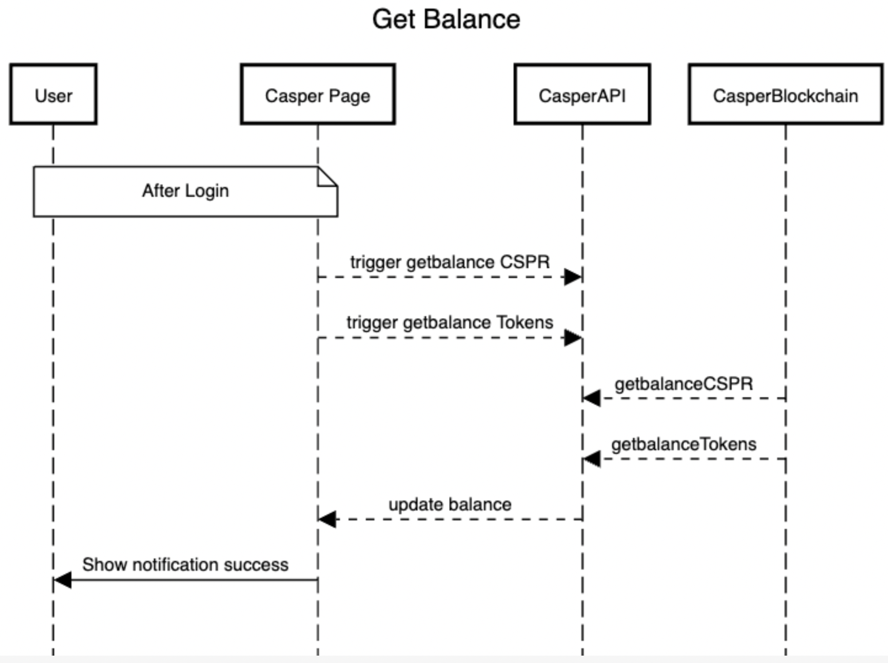

# Process in casperSwap

login process sequence diagram



https://sequencediagram.org/


```
title Get Balance

note over User,Casper Page: After Login
Casper Page-->CasperAPI: trigger getbalance CSPR
Casper Page-->CasperAPI: trigger getbalance Tokens
CasperAPI<--CasperBlockchain: getbalanceCSPR
CasperAPI<--CasperBlockchain: getbalanceTokens
Casper Page<--CasperAPI: update balance
Casper Page->User:Show notification success

```


