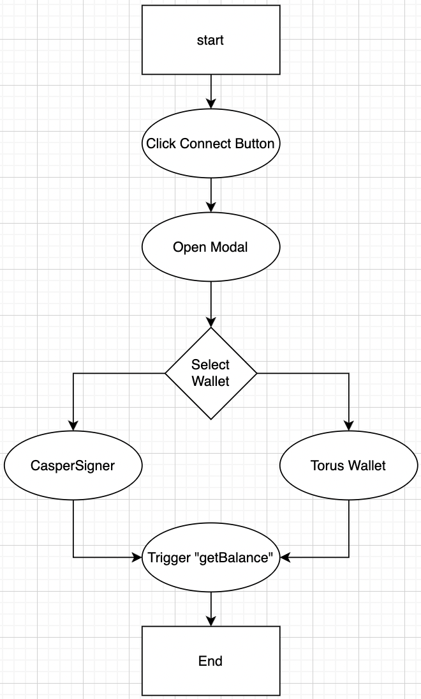
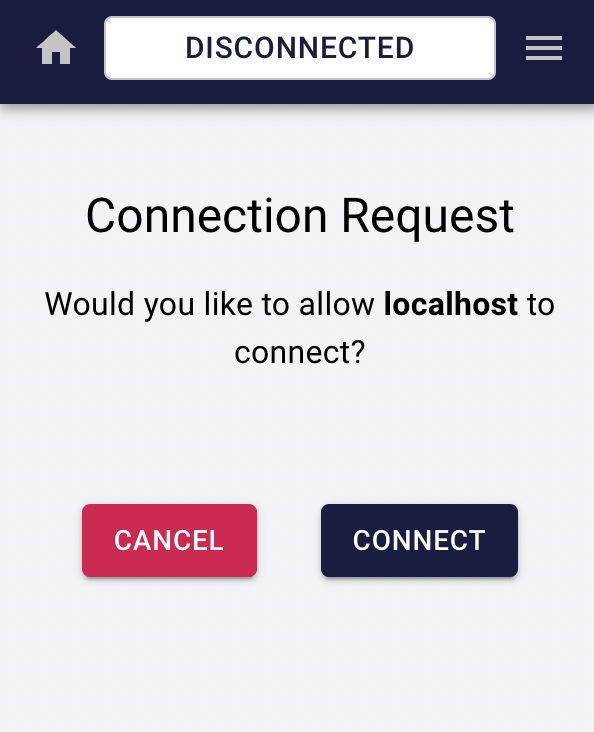
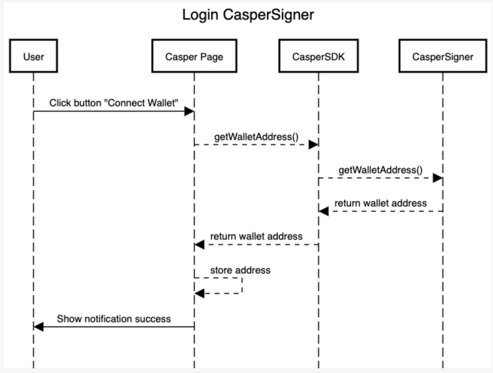
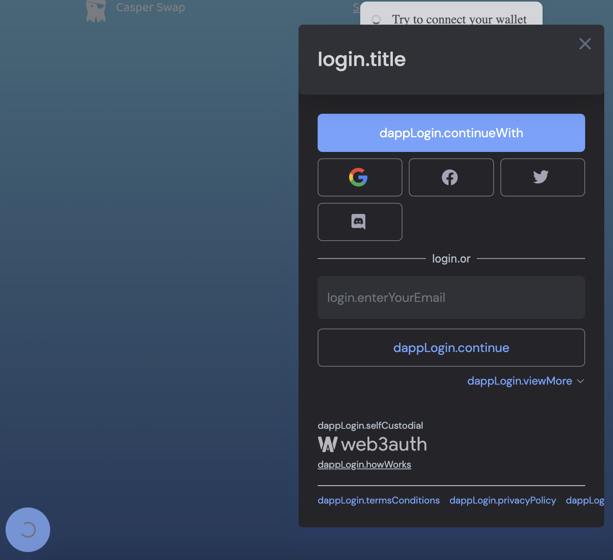
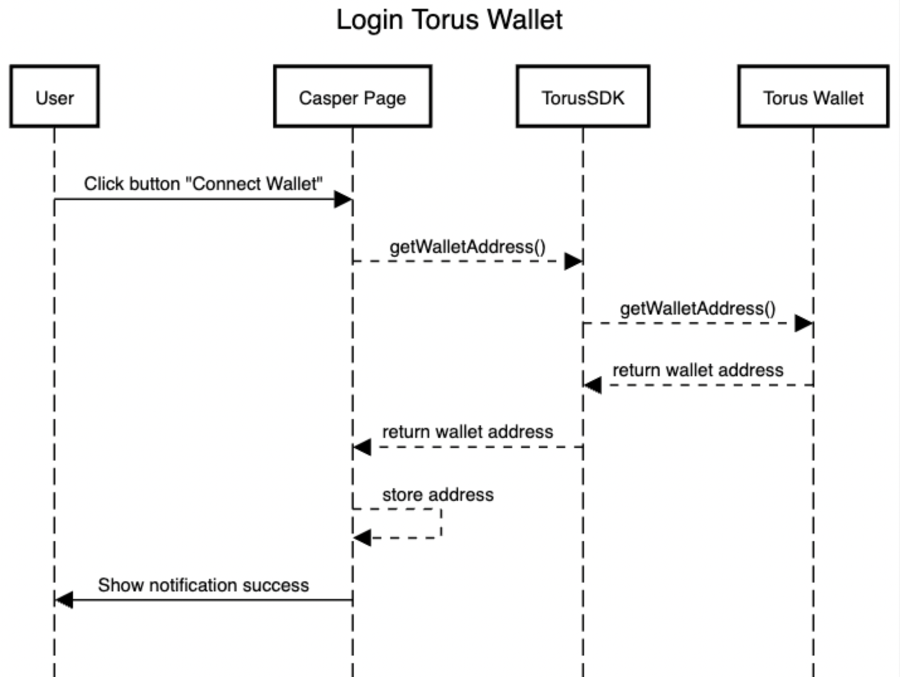

# Process in casperSwap

login process sequence diagram

## Login Flow



## Signer Flow

when is the first time in casper page, user need allow connection first



then signer can be used



https://sequencediagram.org/


```
title Login CasperSigner

User->Casper Page:Click button "Connect Wallet"
Casper Page-->CasperSDK: getWalletAddress()
CasperSDK-->CasperSigner: getWalletAddress()
CasperSDK<--CasperSigner: return wallet address
Casper Page<--CasperSDK: return wallet address
Casper Page-->Casper Page: store address
Casper Page->User:Show notification success

```

## Torus Flow

when is the first time in casper page, user need allow connection first



and then we need auth with selected method, and then in the left button corner the icon of torus will be appear


then torus can be used



https://sequencediagram.org/


```
title Login Torus Wallet

User->Casper Page:Click button "Connect Wallet"
Casper Page-->TorusSDK: getWalletAddress()
TorusSDK-->Torus Wallet: getWalletAddress()
TorusSDK<--Torus Wallet: return wallet address
Casper Page<--TorusSDK: return wallet address
Casper Page-->Casper Page: store address
Casper Page->User:Show notification success
```

## Logout

for both wallet the button are the same, just clicking the wallet address and then the wallet perform a logout

