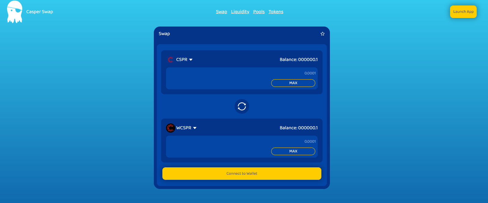
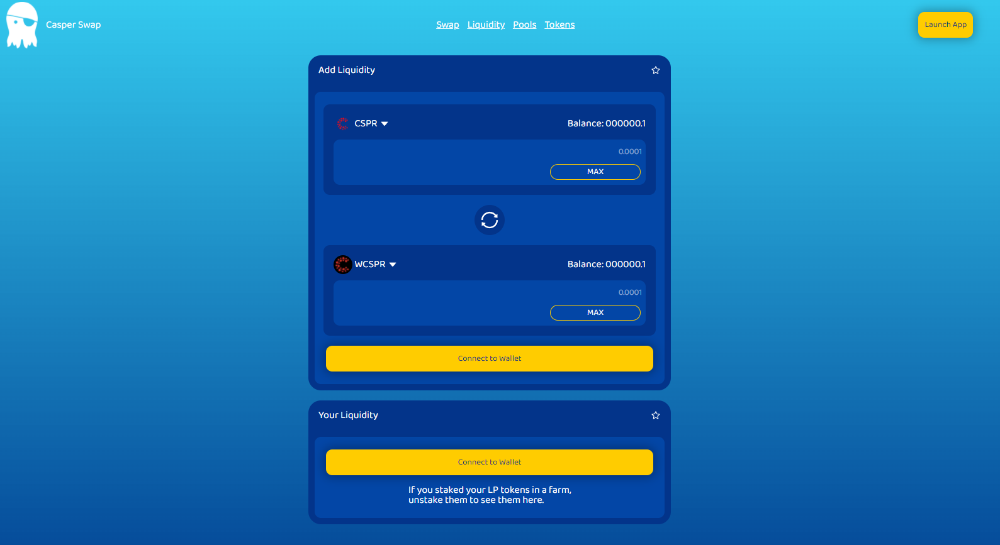

# questions about usability inside of swap

## Landing

### Items

* Brand image + Brand name

*Interaction*: when button is pressed go landing page "/"

* Analitycs

*Interaction*: #TODO idk url to redirect

* Launch App

*Interaction*: when button is pressed go landing page "/swap"

* Hero title

*No interaction*

* Hero image

*No interaction*

#TODO vectorice please

* Stadistics Row

*No interaction* 

#TODO came from backend? coingecko maybe?

## Swap

### Items

* Navigation bar

*Interaction*: when button is pressed move around the site

#TODO: add floor when nav is active

* Launch app button

*Interaction*: 

#TODO if wallet is not connected switch to connect to wallet

* Swap module

*Interaction*: load token from ??

*Interaction*: load token balance from wallet

*Interaction*: connect to wallet button switch to another button if wallet is connected

What is the next step if the user connects the wallet?

**Restriction**:

#TODO don't duplicate token when user should select

example: if user select token 1 cspr, the option cspr should be disable for input 2

## Liquidity

### Items

* Your Liquidity

*Interaction*: 

#TODO load token wallet

What is the next step if the user connects the wallet?

## Pool

### Items

* Pairs

*Interaction*: Sort by in every column

the data came from?

## Tokens

### Items

* Pairs

*Interaction*: Sort by in every column

the data came from?

*Interaction*: Trade button push "/swap?tokenOne=${nameToken}

